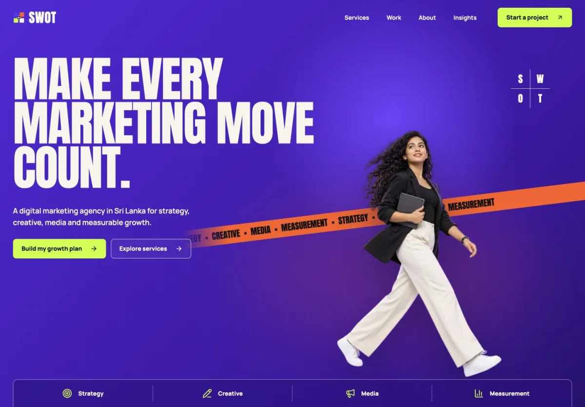
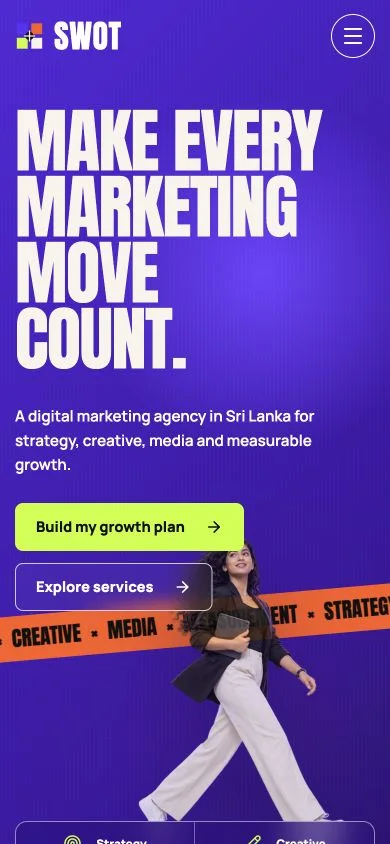

# SWOT.lk

SWOT is a production-oriented Next.js website for a Sri Lankan digital marketing, creative and performance practice from CodeZela Technologies.

## Preview

<table>
  <tr>
    <th>Desktop</th>
    <th>Mobile</th>
  </tr>
  <tr>
    <td></td>
    <td></td>
  </tr>
</table>

The production UI uses an original Sri Lankan image library, responsive editorial layouts and restrained motion with reduced-motion support.

## Stack

- Next.js 16 App Router
- React 19 and strict TypeScript
- Bun package management
- Motion for restrained reveal animation
- Resend for enquiry delivery
- Cloudflare Turnstile with mandatory server-side validation
- Local, optimised WebP brand imagery
- Static service, platform, industry, location and insight pages
- Structured data, canonical metadata, sitemap and robots controls

## Local development

```bash
bun install
bun run dev
```

Cloudflare's official always-pass Turnstile test keys are used automatically in local development when production keys are absent. Resend delivery is not simulated as a real email. Without `RESEND_API_KEY`, the local form reports that validation passed but email delivery still needs configuration.

## Environment

Copy `.env.example` to `.env.local`, then add:

- `RESEND_API_KEY`
- `CONTACT_FROM_EMAIL`, using a sender on a Resend-verified domain
- `CONTACT_TO_EMAIL`
- `NEXT_PUBLIC_TURNSTILE_SITE_KEY`
- `TURNSTILE_SECRET_KEY`

The intended sender is `SWOT Notifications <notifications@swot.lk>` and enquiries are delivered to `hello@swot.lk`. Verify `swot.lk` in Resend before testing delivery. For production, restrict the Turnstile widget to `swot.lk` and `www.swot.lk`. Do not deploy Cloudflare test keys.

## Quality gate

```bash
bun run check
```

This runs ESLint, TypeScript and the production Next.js build.

## Content architecture

- `/services` and 12 detailed service pages
- `/platforms` and 5 platform pages
- `/industries` and 6 industry pages
- `/locations` and 4 local pages
- `/insights` and 6 original guides
- About, work model, contact, privacy and terms pages

The full keyword and post-launch plan is in [`docs/seo-strategy.md`](docs/seo-strategy.md).

## Production checklist

1. Verify `swot.lk` in Resend and confirm delivery from `notifications@swot.lk`.
2. Configure the production Turnstile keys and permitted hostnames.
3. Reconfirm the published CodeZela Colombo office, landline and social profiles before launch if company details change.
4. Run `bun run check`.
5. Verify desktop, mobile, keyboard navigation, the contact success path and the email received in the real inbox.
6. Verify metadata, structured data, sitemap and live canonical URLs.
7. Add Search Console and Bing Webmaster Tools after the domain is live.
